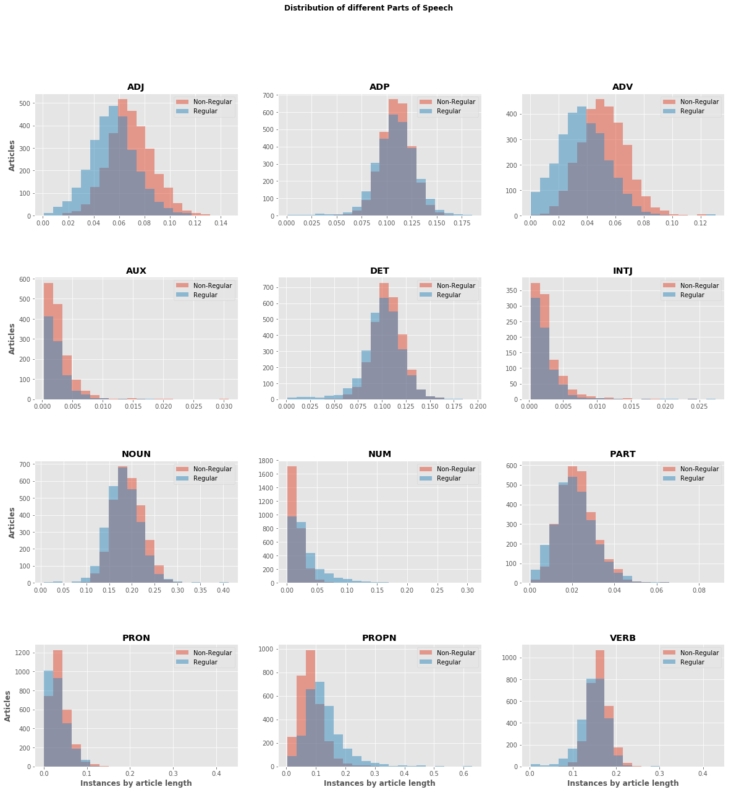

### Exploratory data analysis of different Parts of Speech in Regular and Non-Regular Articles

In this notebook, we will look at the distribution of different parts of speech in regular and non-regular articles. 

We would be looking at how many times different parts of speeches were used in an article. We first calulate a `Instance per article length` metric which evaluates the percentage of that POS appearing in the article. We then look at the distribution of `instance per article length` with the count of `articles` for both regular and non regular articles

To ensure that the distribution are comparable, we have undersampled the "Regular" class

Our general Hypothesis before this experiment is that the POS speech used in Regular and Non regular articles would be different

Let us first look at the different parts of speech detected. We use Spacy package from Python to conduct this experiment

**Different Parts of speech**

`ADJ` : adjective

`ADP` : adposition

`ADV` : adverb

`AUX` : auxiliary verb

`CONJ` : coordinating conjunction

`DET` : determiner

`INTJ` : interjection

`NOUN` : noun

`NUM` : numeral

`PART` : particle

`PRON` : pronoun

`PROPN` : proper noun

`PUNCT` : punctuation

`SCONJ` : subordinating conjunction

`SYM`: symbol

`VERB` : verb

`X` : other

**Results and observations**

Most of the Graphs follow a normal distribution, which was quite expected. But there are some striking differences in the distribution of parts of speech in the two classes:

- Parts of speech like `Adjective` and `Adverbs` seem to be used more frequently in Non-Regular Articles than in Regular Articles. This is probably because non regular articles (Editorials, Oped, Guest editorial) are generally more opionated than regular articles and are often are more of a "decriptive analysis" of the Nouns (Person/Topic of interest) and Verbs (Action of interest), than factual news items. Similarly, `Determiners`, `Particles`, `Nouns` and `Verbs` are slightly higher as well, but are not that significant

- On the other hand, `Numbers` and `Proper-Nouns` are on a higher side in  Regular Articles than in Non-Regular Articles. The explaination is quite obvious in case of `Numbers`, as Regular articles contain more factual information like numbers and quantities than Non-regular articles. It is not obvious in case of `Proper-Nouns`, but we believe that they have a higher share in the article text than in Non-regular news articles because Regular articles talk about a wide range of different (but related) 'subjects' in the same article, but Non-regular opinions do not have that wide of a range of subjects to talk about and stick to a same person of interest (probably the reason they have slightly more of `Pronouns` use than regylar articles). 

**Notes**

- Regular articles are taken as regular and the rest are characterised as "Non-Regular"

- The data for Regular articles is undersampled

- The bins in the charts are are left exclusive (i.e the first bin does not include the value 0), So all articles with count 0 for a particular part of speech will be discarded from the graph

